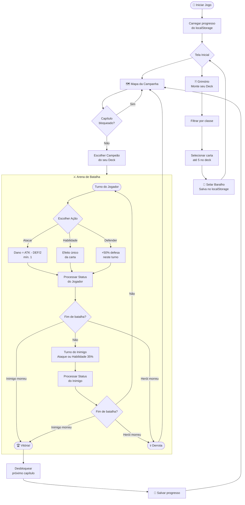
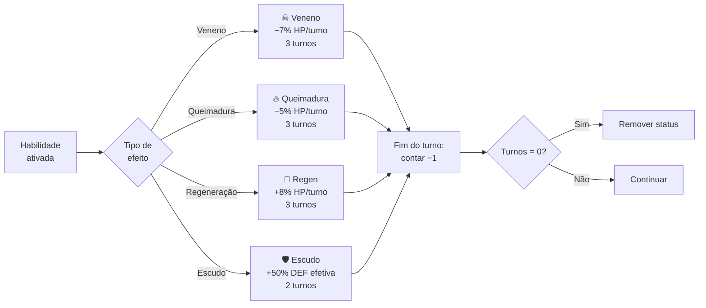
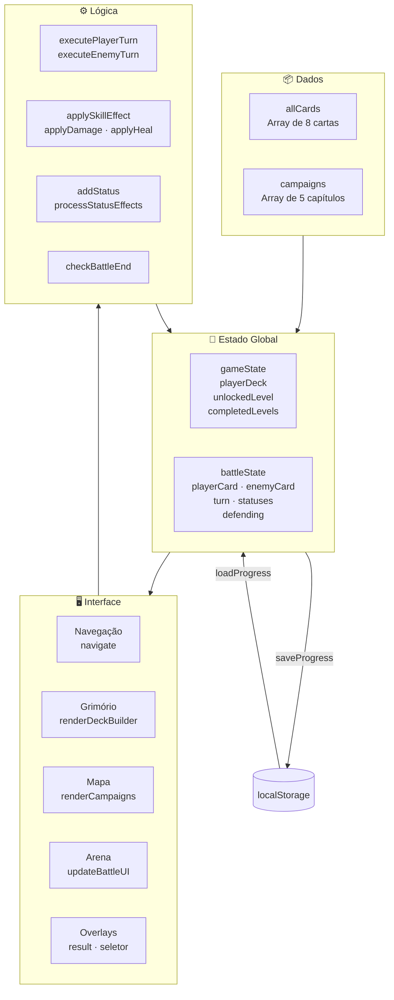

# ⬡ DEMO — Card RPG

> *"Cada vitória revela novos horrores. Cada derrota, uma lição escrita em sangue."*

Um RPG de cartas singleplayer jogado no navegador — sem dependências, sem build, sem framework. Apenas HTML, CSS e JavaScript puro.

---

## 📁 Estrutura do Projeto

```
abismo-arcano/
├── index.html       ← Estrutura e telas do jogo
├── style.css        ← Visual completo (dark gothic)
├── script.js        ← Toda a lógica do jogo
└── README.md        ← Você está aqui
```

> **Como rodar:** abra o `index.html` direto no navegador. Sem servidor necessário.

---

## 🎮 Funcionalidades

| Área | O que tem |
|---|---|
| 🃏 Grimório | Monte um deck de até **5 cartas**, filtre por classe |
| 🗺️ Campanha | **5 capítulos** com dificuldade progressiva |
| ⚔️ Batalha | Sistema de turnos com **Atacar / Habilidade / Defender** |
| ✨ Habilidades | **8 efeitos únicos** — veneno, escudo, dreno, crítico e mais |
| 📜 Status | Efeitos persistentes com contador de turnos |
| 💾 Save | Progresso salvo automaticamente no `localStorage` |

---

## 🃏 Cartas Disponíveis

| Carta | Classe | HP | ATK | DEF | Habilidade | Efeito |
|---|---|:---:|:---:|:---:|---|---|
| 🧙 Mago do Vazio | Mago | 30 | 18 | 5 | Explosão Arcana | Ignora toda a defesa |
| 🗡️ Cavaleiro de Ônix | Guerreiro | 55 | 13 | 18 | Investida Pesada | Ataca + aplica Escudo |
| 🏹 Arqueira Sombria | Arqueiro | 28 | 24 | 4 | Flecha Envenenada | Aplica Veneno (3t) |
| 💀 Necromante | Mago | 38 | 16 | 9 | Roubo de Vida | Drena HP do inimigo |
| 🌿 Druida da Névoa | Druida | 45 | 11 | 14 | Regeneração | Regenera HP (3t) |
| ⚜️ Paladina Ardente | Guerreiro | 48 | 15 | 16 | Chama Sagrada | Aplica Queimadura (3t) |
| 🗝️ Assassina das Sombras | Arqueiro | 24 | 28 | 3 | Golpe Crítico | Chance de dano 2.2× |
| ⚡ Elementalista | Mago | 34 | 20 | 7 | Tempestade Arcana | Ataca + remove buffs |

---

## 🗺️ Capítulos da Campanha

```
Cap. I  ──[Fácil]──  Guarda Corrompido   (Cavaleiro de Ônix)
Cap. II ──[Fácil]──  Cultista Sombrio    (Necromante)
Cap. III──[Médio]──  Ent Corrompido      (Druida da Névoa)
Cap. IV ──[Difícil]─ Paladino das Cinzas (Paladina Ardente)
Cap. V  ──[CHEFE]──  Arquimago do Caos   (Mago do Vazio)
```

Cada vitória desbloqueia o próximo capítulo e é marcada como **✓ Completo** no mapa.

---

## 🔄 Fluxo do Jogo



---

## ⚡ Sistema de Status

Os efeitos persistem por turnos e são processados ao **fim de cada turno** de quem os carrega.



---

## 🧮 Fórmulas de Combate

```
Dano Normal   = max(1, ATK_atacante − ⌊DEF_defensor / 2⌋)
Dano c/Defesa = max(1, ATK_atacante − ⌊(DEF × 1.5) / 2⌋)

Dreno de Vida:
  → Dano = ATK × 0.9
  → Cura = Dano × 0.6

Golpe Crítico:
  → 70% de chance: dano × 2.2
  → 30% de chance: dano × 1.5

Veneno / Queimadura / Regen calculados sobre o HP máximo da carta.
```

---

## 🧱 Arquitetura do Código



---

## 🛠️ Detalhes Técnicos

- **Zero dependências** — sem npm, sem build, sem bundler
- **Fontes** via Google Fonts (Cinzel Decorative, IM Fell English, JetBrains Mono)
- **Persistência** via `localStorage` com chave `abismoArcano_v2`
- **Animações** 100% em CSS (`@keyframes`, `transition`)
- **Responsivo** — funciona em mobile com media queries em 900px e 600px
- **Compatibilidade** — Chrome, Firefox, Safari, Edge (qualquer navegador moderno)

---

## 🔮 Possíveis Expansões

- [ ] Múltiplas cartas em campo simultaneamente (batalha 3v3)
- [ ] Sistema de XP e evolução de cartas
- [ ] Loja com moeda ganhas por vitórias
- [ ] Efeitos sonoros e trilha com Web Audio API
- [ ] Modo PvP local (dois jogadores, mesma tela)
- [ ] Novas classes: Vampiro, Monge, Bardo
- [ ] Animações de habilidade com partículas CSS

---

<div align="center">

*Feito com HTML · CSS · JavaScript puro*

**⬡ DEMO RPG ⬡**

</div>
